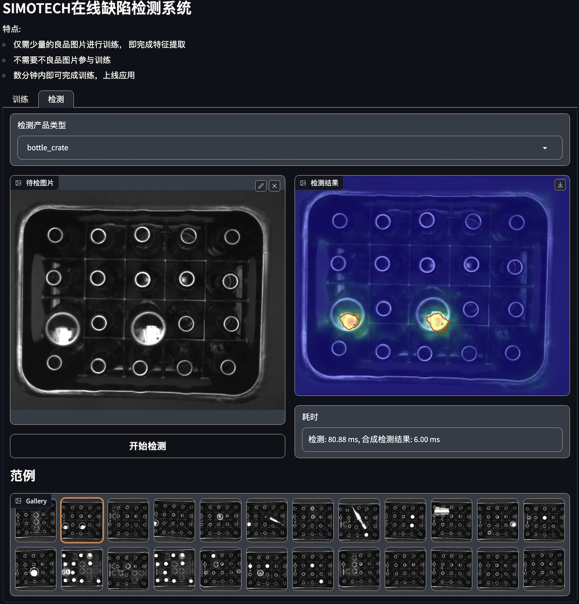
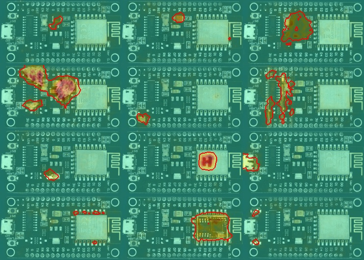

# 基于 OpenVINO 的无监督缺钱检测系统 Demo

## 0x01 介绍

[Anomalib Github 地址](https://github.com/openvinotoolkit/anomalib)

Anomalib 是一个深度学习库，旨在收集最先进的异常检测算法，以便在公共和私有数据集上进行基准测试。Anomalib 提供了近期文献中描述的异常检测算法的几种即用型实现，以及一套便于开发和实现自定义模型的工具。该库重点关注基于图像的异常检测，算法的目标是识别异常图像或数据集中图像的异常像素区域。

Anomalib 具有以下特点:
- 有大量现成可用的深度学习异常检测算法和基准数据集
- 基于 PyTorch Lightning 编写了一套最大化通用的模型，可以帮助我们减少大量模板代码，可以帮助我们将更多的精力放在重要的事情上。
- 所有模型均可导出到支持英特尔硬件加速的 OpenVINO 格式 。
- 一套推理工具，用于快速、轻松地部署标准或自定义异常检测模型。
- 在普通电脑上就可以进行毫秒级的检测

根据[Anomalib 使用教程](https://openvinotoolkit.github.io/anomalib/getting_started/index.html)我们可以快速的上手 Anomalib。

通过 Anomalib 我们了解到在异常检测领域最新的研究都在使用无监督式的机器学习，即只使用良品的图像进行训练即可检测出不良品。这解决了实际生产过程中需要手机不良品来参与算法调试、开发的烦恼。
同时，我们利用 Anomalib 对比了 STFPM、PaDim、PatchCore、EfficientAD-S 等算法，根据我们自己的数据集在图像级和像素级检测上均取得不错的效果。

总的来说就是，在消费级显卡上，我们可以仅需`少量的良品图片`，进行`几分钟`的训练，即可完成一个在线异常检查的应用。

刚好，此时我们刚上手一个[爱克斯开发板](https://www.xzsteam.com/docs/index.html)，官方给的资料已经很详细了，功能和参数部分就不再赘述。[官方资料](https://www.xzsteam.com/docs/index.html)
通过仔细浏览后我们发现其具备了较低的功耗、小巧的体积、一定的算力(0.6TOPS)几个特点，结合当下强大的 AI 技术，我们就想尝试搭建一个通用的、能快速搭建并上线的缺陷检测系统。

系统分为训练、检测两大模块。
训练部分由 AIxBoard 采集正常样本图片并上传到服务器，并在服务端进行训练，完成后回传训练好的模型到 AIxBoard 上，完成环境的部署。
下载好模型的的 AIxBoard 就具备了检测的能力，通过外部触发接口和数据上传接口，就可以部署在产线上对产品进行检测，并将结果上传到服务器上。示意图如下：


## 0x02 原理

本文讨论的无监督式机器学习异常检测的基本原理，简单来说就是使用一组教师-学生网络做特征比对, 比对差异较大的即为异常图像.

在此基础上, 发展出了 STFPM、 PaDiM、 PatchCore、 EfficientAD 等算法。 他们的差异主要在于神经网络结构、用于全局分析的特征编码器、自动编码器、多层特征混合计算、损失评估算法等不同。

针对我们的检测应用，以上算法均能满足需求的前提下，我们选用了速度最快的 STFPM+ResNet18 模型来进行测试，详见论文: [STFPM](https://arxiv.org/pdf/2103.04257.pdf)。


## 0x03 优势

对比传统的异常检测算法，我们需要针对不同的产品编写一套针对性的检测代码，还需要一定量的不良品来测试和优化检测算法。而使用机器学习方法，我们只要统一的一套通用的训练程序和几张良品即可。

## 0x04 生产过程
本次测试我们使用两组照片来创建两个应用，一组由 3 张正常的 pcb 板照片组成，一组由 4 张正常的饮料箱照片组成。
### 0x0401 训练
经过 400 epochs 训练，loss 降到了 0.32。


### 0x0402 部署
使用 OpenVINO 中的工具将模型导出成 OpenVINO 格式(IR)：
```python
from openvino.tools import mo  
from openvino.runtime import Core, serialize  
  
# Convert model to openvino.runtime.Model object  
ov_model = mo.convert_model(model)  
  
# Save openvino.runtime.Model object on disk  
serialize(ov_model, "test_model.xml")  
```

将导出的模型拷贝到 AIxBoard 上，使用 Anomalib 的推导工具 `openvino_inference.py` 即可在 AIxBoard 上进行加速推导。
### 0x0403 检测
目前在 AIxBoard 上已使用 iGPU 进行加速检测，可以将检测时间控制在 100ms 以内。但根据[官方手册中提到的优化方法](https://openvinotoolkit.github.io/anomalib/tutorials/export.html#optimization)，使用Neural Network Compression Framework (NNCF)还能在此基础上进一步的加速。目前该方法还处于试验阶段，仅在 STFPM 模型上可用。

以下是一些检测的效果图:





## 0x05 总结
在没有经过调优的情况下，我们的模型仅使用了 3 张良品照片进行简单的训练，即可上线检测并取得不错的效果。通过使用 Anomalib 我们不仅可以使用少量的良品特征快速构建一个异常检测应用，还可以免去收集不良品特征的过程，再结合 AIxBoard 可以快速将应用部署到产线上。

